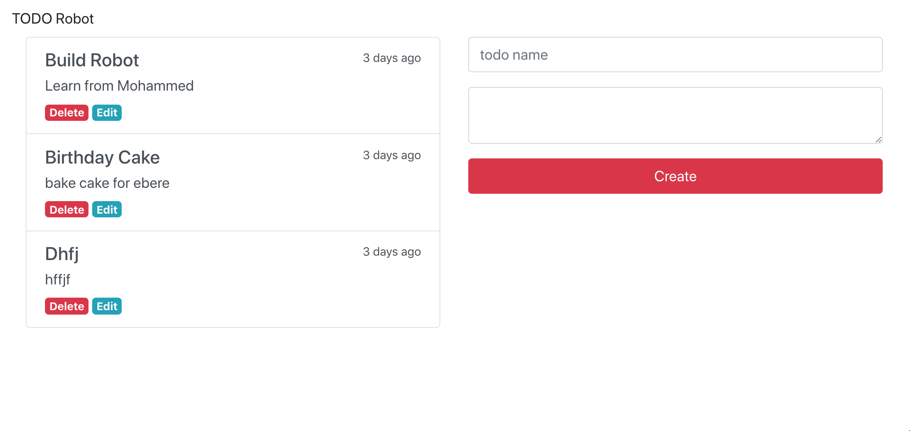

# MERN - MongoDB Express React NodeJs

  

## Introduction

We've now seen how React is able to render HTML in the DOM with the help of JSX. We've also combined JavaScript and JSX to loop through arrays of data and apply that data to components via this.props.

Our mission now is to build a frontend app for a robot. On this site you will be using React to build out small components for each section of the site, and show info about their menu and locations through data we've provided.



### Let’s take a quick look at the four packages:
***express:*** Express is a fast and lightweight web framework for Node.js. Express is an essential part of the MERN stack.

***body-parser:*** Node.js express body parsing middleware.

***cors:*** CORS is a node.js package for providing an Express middleware that can be used to enable CORS with various options. Cross-origin resource sharing (CORS) is a mechanism that allows restricted resources on a web page to be requested from another domain outside the domain from which the first resource was served.

***mongoose:*** A Node.js framework which lets us access MongoDB in an object-oriented way.

***concurrently:*** A package to allow us start both node and react with one command.
  

## Setup

You will be working in the `week_10_node_react` folder. This repository was created using `npm init` for nodejs and `create-react-app frontend` for the reactjs app, but has additional data and styling.

  

1. Install `npm install -g concurrently` use `sudo npm install -g concurrently` if need be

1. Install the dependencies using `npm install` in the root directory

1. Install the dependencies for reactjs `cd frontend && npm install`

1. Open your text editor.

1. Start the dev server using `npm run dev` ***this will start express and reactjs together**
  

# Backend NodeJS

To build the backend in nodejs and mongodb we need to:

1. Start mongodb by running `mongod` in the terminal

```
$ mongod
```
Initialize a nodejs app and following the commands:
```
$ npm init
$ touch server.js
$ npm i mongoose express cors dotenv
```

In our `server.js`
 ```js
 require('dotenv').config()
const express = require('express')
const app = express()
const PORT = process.env.PORT || 7777
const URL = process.env.URL
const todoRoutes = require('./routes/todoroutes')
const mongoose = require('mongoose')
const cors = require('cors')


app.use(cors()) // add cors middleware

app.use(express.json()) //recieve json from req.body

mongoose.connect(URL, {useNewUrlParser : true})
.then(()=> console.log("mongdb running"),
 (err) => console.log(err))


// prefix todos to routes
app.use('/todos', todoRoutes)

//listen on port
app.listen(PORT, () => console.log(`active on ${PORT}`))

 ```

### Create a Mongoose Schema
By using Mongoose we’re able to access the MongoDB database in an object-oriented way. This means that we need to add a Mongoose schema for our Todo entity to our project implementation next.


```
$ mkdir models
$ cd mkdir
$ touch todo.js
```
inside `todo.js`

```
const mongoose = require('mongoose')
const Schema = mongoose.Schema

const todoSchema = new Schema({
 name : { type: String, required: true},
 description: { type: String, maxlength: 100},
 status : { type: Boolean, default: false}

}, {timestamps : true})

const Todo = mongoose.model('Todo', todoSchema)
module.exports = Todo
```

### Creating end points
CRUD routes
```
const express = require('express')
const router = express.Router()
//import todo model
const Todo = require('../models/todo')

//find all todos
router.get('/', (req, res)=> {

 Todo.find()
 .then((todos)=> {
  res.json({ todos : todos })
 })
 .catch(err => {
   res.json({ message : "Something went wrong!!!"})
 })

})

//post new todo
router.post('/', (req, res)=> {

 let todo = new Todo(req.body)
 
 todo.save()
 .then(() => {
   res.json({ 
    message : "Todo Created Successfully!", 
    todo: todo
   })
 })
 .catch((err) => {
   res.json({ 
    message : "Something went terribly wrong!"
   })
 })
})

// http://localhost:7777/todos/123747588588558
router.get('/:id', (req, res)=> {
 
 Todo.findById(req.params.id)
 .then((todo) => {
  res.json({todo})
 })
 .catch(err => {
  res.json({message : "حدث خطأ ما 404"})
 })
})

router.put('/:id', (req, res)=> {

 Todo.findByIdAndUpdate(req.params.id, req.body)
 .then(()=>{
  res.json({message : "تم التحديث"})
 })
 .catch(err => {
  res.json({message : "حدث خطأ ما "})
 })

})

router.delete('/:id', (req, res)=> {
  console.log("ok")
 Todo.findByIdAndDelete(req.params.id)
 .then(()=>{
  res.json({message : "تو الحذف"})
 })
 .catch(err => {
  res.json({message : "حدث خطأ ما "})
 })

})

module.exports = router
```


# Frontend ReactJS
```
$ create-react-app frontend
```

